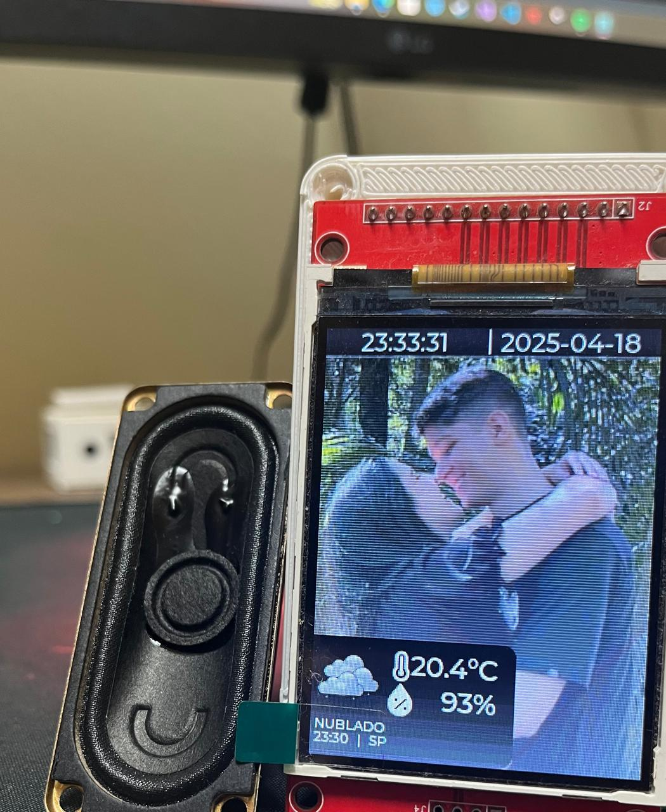

# WEATHER_CLOCK
Este projeto é uma aplicação baseada em Arduino que utiliza a biblioteca LVGL para criar uma interface gráfica interativa. Ele exibe informações meteorológicas, como temperatura, umidade e descrição do clima, além de reproduzir áudio com base nos dados exibidos.

## Funcionalidades

- **Interface gráfica**: Desenvolvida com a biblioteca LVGL, exibindo informações meteorológicas em tempo real.
- **Conexão Wi-Fi**: Conecta-se a uma rede Wi-Fi para obter dados meteorológicos e sincronizar o horário via NTP.
- **Áudio**: Reproduz descrições do clima em português utilizando síntese de voz.
- **Imagens**: Utiliza imagens para representar diferentes condições climáticas.

## Exemplo de Interface

Abaixo está uma imagem de exemplo da interface gráfica:

  

